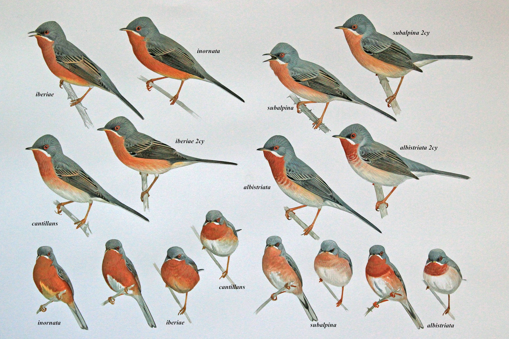
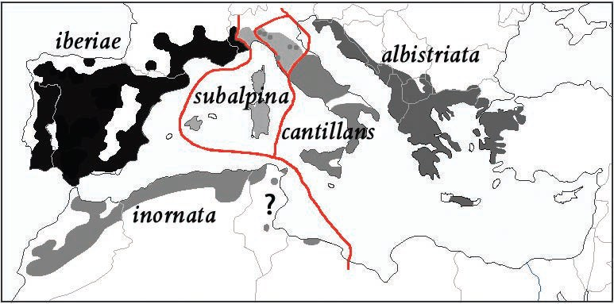

# Taxonomies and the challenges of representing evolutionary relationships

## The basics

Modern biological classification is an activity in which biological organisms are recognized and grouped, with the purpose of analyzing and understanding their **phylogenetic** (evolutionary) relationships. The grouping of organisms is based on their shared _and_ derived characteristics. Today the most important characteristics are genetic, but other characteristics that can be used are morphological, physiological and behavioral as well as the ecological and geographic distribution of the organisms. The characteristics that are important for sexually reproducing organisms, are those that have influence on the viability of the offspring and/or their capability of reproducing and on the probablity of mates selecting each other.

The general name in biological classification for these groups is **taxa** (singular **taxon**) and taxa are arranged in hierarchical classification structures called **taxonomies** (singular **taxonomy**). Often these classification  structures have the formal structure of a tree. Most readers will be familiar with the classical hierarchical tree with orders, families, genera and species. However, a tree is actually not a suitable structure for modelling evolutionary relationships for a number of reasons, that have been very well described and summarized by János Podani in his article _The Coral of Life_[^1] from 2019. Podani also presents good arguments for that coral structures are a better metaphor for envisioning evolutionary development. It seems to me that a better proper mathematical structure than a tree, to represent evolutionary relationships, would be to use a DAG (Directed Acyclic Graph). But let's skip this discussion for now, and assume that we can represent all ~11.000 birds and their evolutionary relationships in a traditional hierarchical tree.

The most fundamental kind of taxa are **species** and **subspecies** which are categorisations of actual living organisms. When scientists describe a species or a subspecies they must always have at least one physical specimen on which their description is based. These so called **type specimens** are placed in storage at biological institutions so that other scientists can examine them if the need for reclassification should arise.

Species are then grouped into taxa called **genus** and one of the species in each genus is designated the **type species**, which can be said to indicate the typical species of that genus. Genus are then categorised into **familes** and they in turn, are grouped into higher and higher **ranks** of taxa. 

Each taxon, including genus, species and subspecies are defined by a **concept** consisting of a **description** of the taxa and its characters as well as a **diagnosis** which describes the unique characters that differentiate it from other closely related taxa.

The naming of taxa is based on rules defined by the [ICZN (International Commission on Zoological Nomenclature)](http://iczn.org) and the [ICN
(International Code of Nomenclature for algae, fungi and plants)](http://www.iapt-taxon.org/nomen/main.php) and the rules for species names is based on binomial nomenclature system invented by Carl Linnaeus. These rules cover both the valid forms of names as well as the criteria for deciding which name is valid, in the case of the same taxa being described but given different names by different authors. It is important to not that taxa in themselves are not fixed as regards to their rank. It is usual that the first descriptive publication of a new taxon suggests or argues for a rank, but that may be revised at a later time. Also, at any given time there may be disagreement about which rank the taxon should have and thus exist different taxonomies, each assigning the taxon a different rank or a different position in the taxonomical tree.

To summarize; a taxon is always:

 * identified by a name,
 * described by a concept and
 * at the species and subspecies level, is associated with a type specimen.
 * associated by at least one rank and a position in a taxonomy. But may also be associated with other ranks and/or positions in other taxonomies.

At any given time there may exist different taxonomies for the same group of organisms, due to the fact that there are different scientific opinions on how to classify these organisms. It is important to understand that just because two taxa in different taxonomies **share the same name, they do not neccessarily share the same concept**. It may also be the case that two taxa in different taxonomies **have different names but actually share the same concept**.

There exist a number of taxonomies and associated bird lists for birds today. By a **bird list** is meant, a taxonomically ordered list of birds, where the first birds belong to the oldest evolutionary line, and the last birds belong to the youngest evolutionary line. The reason for multiple taxonomies and bird lists today, is mainly historical and there is fortunately ongoing work on deciding on a common taxonomy a bird list. This will of course not mean that the taxonomy is fixed and done, but that all important ornithological organizations agree on a common reference taxonomy and bird list. But this taxonomy will certainly change as evidence and reasearch continues.

## The problem of multiple taxonomies and names

The current existance of multiple taxonomies and bird lists represents a challenge to both researches, environmentalists and birders. To illustrate this challenge, as well as the challenge of continued research and new insights, we will look at a group of warblers informally grouped under the name **subalpine warblers**.

 
*Image taken from [this article on identifying subalpine warblers in the field
by Brian J. Small](http://surfbirds.com/Features/subalpine13/main.html)*.

For many years most scientists have agreed that the group consists of five taxa that belong to the genus *Sylvia*, where two taxa are considered proper species and the other three taxa are considered subspecies.

In 2013 Lars Svensson proposed a taxonomic revision of the group into three distinct species. This revision is described in the paper *[A taxonomic revision of the Subalpine Warbler by Lars Svensson, 2013](http://boc-online.org/bulletins/downloads/BBOC1333-Svensson.pdf)*.
The revision is based on genetic, morphological, geographic and behavioral characteristics of the taxa. The geographic distribution ranges of the taxa is presented in the paper and shown below.

*Image taken from the paper by Lars Svensson*.

The proposed revision has not been accepted by all scientists and taxonomic experts. There even exist different opinions on the name of the genus to which the subalpine warblers belong.

In the **[IOC World Bird List (v 7.3) by Gill, F & D Donsker (Eds)](http://www.worldbirdnames.org/ioc-lists/master-list-2/)** from 2017 the group of subalpine warblers is classified into two species; *Sylvia cantillans* and *Sylvia subalpina*. *Sylvia Cantillans* has four
subspecies; *cantillans*, *albistriata*, *iberiae* and *inornata* and *Sylvia subalpina* has no subspecies.

However in **[The Howard & Moore Complete Checklist of the Birds of the World. 4th. Edition by Dickinson, E.C., J.V. Remsen Jr. & L. Christidis (Eds)](https://www.nhbs.com/series/the-howard-and-moore-complete-checklist-of-the-birds-of-the-world)** from 2013-2014 this group is classified into three species, but belong to a different genus *Curruca*. The species being *Curruca cantillans*, *Curruca inornata* and *Curucca subalpina*. *Curruca cantillans* has three subspecies; *cantillans*, *albistriata* and *iberiae*. *Curruca inornata* has one subspecies
*inornata* and *Curruca subalpina* has no subspecies.

And finally, in the **[Bird List of the Taxonomic Committee of Birdlife Sweden](http://birdlife.se/tk/svenska-namn-pa-varldens-faglar/)** from 2017 this group is classified into three species; *Sylvia cantillans*, *Sylvia inornata* and *Sylvia subalpina*. Here *Sylvia cantillans* has two subspecies; *cantillans* and *albistriata* and *Sylvia inornata* has two subspecies *inornata* and *iberiae*.

In this case of the classification of subalpine warblers, we see differences in both taxonomies and in naming of taxa, due to differing opinions on how to classify these birds.

The problem is made even more complicated by the fact that most species, and in some cases also subspecies, have common names in many languages, like english and swedish, and these names are also subject to changes. These names are usually tied more to the species concept than the scientific name! For example the official name in Swedish for *Sylvia Subalpina* is **Moltonisångare**. If the Swedish Taxonomic committee would decide to adapt the genus name *Curruca* used in the Howard & Moore checklist, the Swedish name **Moltonisångare** will most surely be kept, even though the scientific name will have changed.

These differences in taxonomies and in names is a problem both for researchers and people working with ecological studies as well as for birders who want to keep track of which birds they've seen. For researchers and other professionals the problem is knowing if different articles are actually talking about the same species or not, and for birders it is a problem of deciding and agreeing on which taxonomy to use for their lists of observed birds.

This is the wonderful world of confusing names and taxonomies!

[^1]: Podani, J. _The Coral of Life_. **Evolutionary Biology 46**, 123–144 (2019). https://doi.org/10.1007/s11692-019-09474-w.
