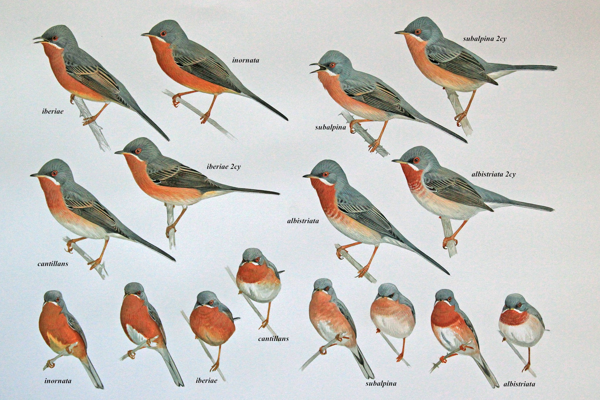
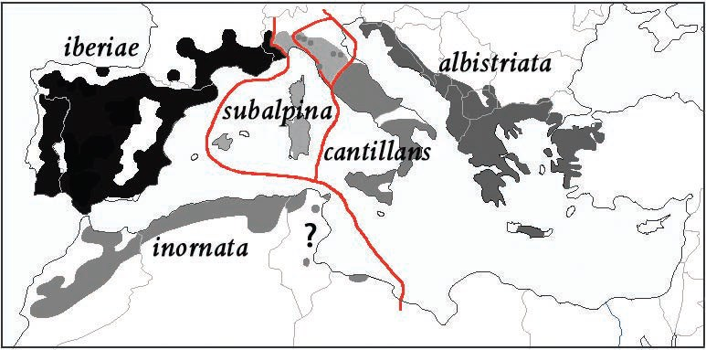

# Notes on handling multiple taxonomies

## The basics

Modern biological classification is an activity in which biological organisms
are recognized and grouped with the purpose of understanding their
**phylogenetic** (evolutionary) relationships. The grouping of organisms is
based on their characteristics and today the most important characteristics are
genetic, but other characteristics that can be used are morphological (external
appearance), physiological, behavioral, ecological and geographic characters.

The general name in biological classification for these groups is **taxa**
(singular **taxon**) and taxa are arranged in hierarchical classification
structures called **taxonomies** (singular **taxonomy**).

The most fundamental kind of taxa are **species** and **subspecies** which are
categorisations of actual living organisms. When scientists describe a species
or a subspecies they must always have at least one physical specimen on which
their description is based. These so called **type specimens** are placed in
storage at biological institutions so that other scientists can examine them if
the need for reclassification should arise.

Species are then grouped into taxa called **genus** and one of the species in
each genus is designated the **type species**, which ican be said to indicate
the typical species of that genus. Genus are then categorised into **familes**
and they in turn, are grouped into higher and higher **ranks** of taxa.

Each taxon, including genus, species and subspecies are defined by a **concept**
consisting of a **description** of the taxa and its characters as well as a
 **diagnosis** which describes the unique characters that differentiate it from
other closely related taxa.

The naming of taxa is based on rules defined by the [ICZN (International
Commission on Zoological Nomenclature)](http://iczn.org) and the [ICN
(International Code of Nomenclature for algae, fungi and plants)](http://www.iapt-taxon.org/nomen/main.php)
and the rules for species names is based on binomial nomenclature system
invented by Carl Linnaeus. These rules cover both the valid forms of names as
well as the criteria for deciding which name is valid, in the case of the same
taxa being described but given different names by different authors.

To summarize; a taxon is always:

 * identified by a name,
 * described by a concept and
 * at the species and subspecies level, is associated with a type specimen.

At any given time there may exist different taxonomies for the same group of
organisms, due to the fact that there are different scientific opinions on how
to classify these organisms. It is important to understand that just because
two taxa in different taxonomies **share the same name, they do not
neccessarily share the same concept**. It may also be the case that two
taxa in different taxonomies **have different names but actually share the
same concept**.

## The problem of multiple taxonomies and names

To illustrate the complexity and constantly evolving character of taxonomy, as
well as the differing opinions on names, we will look at a group of warblers
informally grouped under the name, **subalpine warblers**.


*Image taken from [this article on identifying subalpine warblers in the field
by Brian J. Small](http://surfbirds.com/Features/subalpine13/main.html)*.

For many years most scientists have agreed that the group consists of five taxa
that belong to the genus *Sylvia* and where two taxa are considered proper
species and the other three taxa are considered subspecies. 

In 2013 Lars Svensson proposed a taxonomic revision of the group into three
distinct species. This revision is described in the paper *[A taxonomic revision
of the Subalpine Warbler by Lars Svensson, 2013](http://boc-online.org/bulletins/downloads/BBOC1333-Svensson.pdf)*.
The revision is based on genetic, morphological, geographic and behavioral
characteristics of the taxa. The geographic distribution ranges of the taxa is
presented in the paper and shown below.



*Image taken from the paper by Lars Svensson*.

The proposed revision has not been accepted by all scientists and taxonomic
experts. There even exists different opinions on the genus to which the
subalpine warblers belong.

In the **[IOC World Bird List (v 7.3) by Gill, F & D Donsker (Eds)](http://www.worldbirdnames.org/ioc-lists/master-list-2/)**
from 2017 the group of subalpine warblers is classified into two species;
*Sylvia cantillans* and *Sylvia subalpina*. *Sylvia Cantillans* has four
subspecies; *cantillans*, *albistriata*, *iberiae* and *inornata* and *Sylvia
subalpina* has no subspecies.

However in **[The Howard & Moore Complete Checklist of the Birds of the World.
4th. Edition by Dickinson, E.C., J.V. Remsen Jr. & L. Christidis (Eds)](https://www.nhbs.com/series/the-howard-and-moore-complete-checklist-of-the-birds-of-the-world)**
from 2013-2014 this group is classified into three species, but belong to a 
different genus *Curruca*. The species being *Curruca cantillans*, *Curruca
inornata* and *Curucca subalpina*. *Curruca cantillans* has three subspecies;
*cantillans*, *albistriata* and *iberiae*. *Curruca inornata* has one subspecies
*inornata* and *Curruca subalpina* has no subspecies.

And finally, in the **[Bird List of the Taxonomic Committee of Birdlife Sweden](http://birdlife.se/tk/svenska-namn-pa-varldens-faglar/)**
from 2017 this group is classified into three species; *Sylvia cantillans*,
*Sylvia inornata* and *Sylvia subalpina*. Here *Sylvia cantillans* has two
subspecies; *cantillans* and *albistriata* and *Sylvia inornata* has two
subspecies *inornata* and *iberiae*.

In this case of the classification of subalpine warblers, we see differences in
both taxonomies and in naming of taxa, due to differing opinions on how to
classify these birds.

The problem is made even more complicated by the fact that most species, and
in some cases also subspecies, have names in natural languages, like english
and swedish, and these names are also subject to changes. These names are
usually tied more to the species concept than the scientific name! For example
the official name in Swedish for *Sylvia Subalpina* is **Moltonisångare**. If
the Swedish Taxonomic committee would decide to adapt the genus name *Curruca*
used in the Howard & Moore checklist, the Swedish name **Moltonisångare** will
most surely be kept, even though the scientific name will have changed.

These differences in taxonomies and in names is a problem both for researchers
and people working with ecological studies as well as for birders who want to
keep track of which birds they've seen. For researchers and other professionals
the problem is knowing if different articles are actually talking about the same
species or not, and for birders it is a problem of deciding and agreeing on
which taxonomy to use for their lists of observed birds.

This is the wonderful world of confusing names and taxonomies!

## The modern use of taxonomies and name lists

The orginal purpose of classification was simply to describe, name and classify
all living organisms, partly as a celebration of gods creation and partly in
order for biologists to be able to communicate about animals and plants in a
unambigous way. With the breakthrough of the discovery of evolution and the
desire to understand evolutionary processes and mechanisms, there was a big
shift from the idea of taxonomies simply beeing a classification to bring order
to an idea of using taxonomies to also describe the evolutionary history of
organisms. The purpose of names is still to be able to communicate and uniquely
identify organisms, but names should also convey the evolutionary position of
taxa in the great and continously ongoing process of evolution.

For birders keeping track of which birds they've seen they need to decide which
taxonomy, or list, they should use as the base for their personal lists.

These two purpuses, that of the scientific community and that of amateur
naturalists, have started to overlapse with the advent of software and online
systems for amateurs to reporting sightings, which then can be used by scientists
and in environmental research in order to identify possible changes in population
trends for different species. These software systems are important tools in
enabling what is today called **[crowd science or citizen science](https://en.wikipedia.org/wiki/Citizen_science)**.
It is more important than ever, to be able to know what species and subspeciesi
we are talking about!

## Taxonomies as information structures

A taxonomy can be represented as a *tree*. Relationships between taxa in
different taxonomies can be represented by *directed graphs* between related
taxa.

### Trees and graphs

A *tree* **T** is a finite set of one or more *nodes* such that (recursively):

 1. there is one special node called the *root* of the tree.
 1. the remaining nodes are partitioned into m disjoint sets **T1**, **T2**,
    **...**, **Tm**, and each of these sets in turn is also a tree. These
    trees are called *subtrees*.

A *directed graph* is a set of *vertices* connected by *edges* where edges have
a *direction* associated with them.

### Representing taxonomies as trees and taxonomic relationships as graphs

When representing a taxonomy as a tree we will refer to nodes as taxa, and we
would like to assign a few attributes to each taxon as follows.

 1. every taxon is assigned a *taxonomic rank*.
 1. every taxon is assigned a *taxonomic name*, *author* and publication date
    in accordance with the ICZN or ICN rules and which is unique within the set
    of taxa with the same rank.
 1. every taxon is assigned a *taxonomic concept*.
 1. every taxon that has the rank of *Species* or *Subspecies* is assigned a
    set of *type specimens*.

When representing relationships between taxa in different taxonomies we would
like to tag the edges with a name describing the relationship, as follows.

 1. A taxon **t1** in the taxonomy **T1** which has the same taxonomic concept
    **c1** as the taxon **t2** in the taxonomy **T2**, will have a bidirectional
    edge with the tag *synonym*, even when the names of **t1** and  **t2** may
     differ.
 1. A taxon **t1** in the taxonomy **T1** and a taxon **t2** in the taxonomy
    **T2** that have different taxonomic concepts but share the same name will
    have a bidirectional edge with the tag *homonym*.

In particular, when having more that two taxonomies we would like to assign yet
two other attributes to each taxon, as follows.

 1. every taxon is assigned a set of edges labled *synonyms* containing edges to
    taxa in other taxonomies that it is synonymous to.
 1. every taxon is assigned a set of edges labled *homonyms* containing edges to
    taxa in other taxonomies that it is homonymous to.

### A data representation for taxonomies

There are many ways to represent trees and graphs in different programming
languages and data formats. There are even many different ways to represent trees
and graphs in any given programming language or data format. Which representation
we choose should be guided by two basic considerations; ease of comprehension
and suitability for the most important operations we may wish to perform on the
taxonomies.

Here I will use [JSON](http://json.org) which is a simple and widely used data
format that supports representing hierarchical structures as well as sets. I
will first present the data structure by example instead of by specification.i
In the examples I will use the taxonomic group of subalpine warblers as
classified by the Swedish Taxonomic Committee previuosly discussed.

This is a JSON representation of *Sylvia cantillans*:
```JSON
{
 "name": "Sylvia cantillans",
 "auctor": "(Pallas, 1764)",
 "rank": "Species",
 "concept": {
             "reference": {
                           "title": "A taxonomic revision of the Subalpine Warbler by Lars Svensson, 2013",
                           "url": "http://boc-online.org/bulletins/downloads/BBOC1333-Svensson.pdf"
                          }
            },
 "type_specimens": [],
 "supertaxon": "Sylvia",
 "subtaxa": ["Sylvia cantillans cantillans", "Sylvia cantillans albistriata"],
 "homonyms": [{
               "taxonomy": "IOC v7.3",
               "name": "Sylvia cantillans"
              }],
 "synonyms": [{
               "taxonomy": "HM 4th ed",
               "name": "Curruca cantillans"
              }],
 "names": {
           "en_GB": ["Subalpine warbler"],
           "sv_SE": ["Rödstrupig sångare"]
          }
}
```

